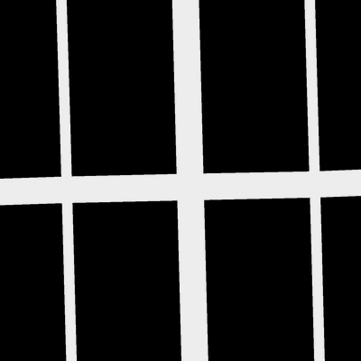

# Road Segmentation 
 Road Segmentation.Image Segmentation using CNN tensorflow with SegNet
 
 **Abstract In  this  work  we  present  two  methods  to  segmentroads  on  satellite  images.  We  first  show  how  we  can  augmentan  image  dataset  when  the  one  at  disposal  is  too  small  toproperly train a machine learning algorithm. Then we quicklydemonstrate what features can be exploited and how to handlethem in order to make the best prediction with a linear logisticregression. Finally, we present a method based on a deep fullyconvolutional  neural  network  architecture  for  semantic  pixel-wise  segmentation  called  SegNet.
 **
 
 ## Introduction
 The goal of this work is to segment roads on satellite images (Figure 1) by using machine learning techniques.
In other words, we want to assign a label (road or background) to each pixel of the image. Before selecting
the best algorithm, an effort is made on how to augment
a small image data set and how to get the most relevant
features out of it. Then we present 2 different classes
of algorithm. The first one is a linear logistic regression
whereas the second one, called SegNet [1] uses a more
complicated scheme based on a convolutional neural
network (CNN).

 
Fig1. Exampel of satellite image 

A set of N = 100 training images of size 400 × 400
pixels is provided. The set contains different aerial
pictures of urban areas. Together with this training set, the
Figure 2.
Ground truth of satellite image example.
corresponding ground truth grayscale images (Figure 2) are
also available. Note that the ground truth images need to
be converted into label images. Concretely, each pixel y i
can only take one of the two possible values corresponding
to the classes: road label (y i = 1) or background label
(y i = 0). In order to binarize the ground truth images, a
threshold of 25% is set. This means that every pixel with
an intensity lower than 75% of the maximum possible value
is set to 0 and the rest is set to 1. With 8 bits images, the
maximum value is 255 which sets the threshold to 191.
This pixel threshold has a direct impact on the width of the
road label in the computed label image.
 
  
 Fig2. Ground truth of satellite image example 
 
 The problem that arises with such a small training set
(100 images only) is overfitting. Moreover in order to train
any convolutional neural network properly it is necessary
to augment the dataset. Analysing the training set, it is
obvious that it contains mainly pictures with strictly vertical
and horizontal roads. For that reason, creating new images
by rotating the original ones allows to increase the size of
the dataset and generates data which will be useful to better
train the algorithm. Specifically, we rotate each image by
angles going from 5 to 355 degrees every 5 degrees (i.e. 5,
10, 15,..., 355). That way we generate a set of images with
roads in every directions. In summary, for each image of
the original training set, 70 images are generated using therotations, resulting in a new training set of 7100 images.
This augmented training set is then suitable for the training
of the CNN.

## Methodology

In order to gain computational efficiency, square patches
can be used instead of working with every pixels (see Figure
3). This make sense because a road is never composed by
a single pixel but is rather made of blocks of pixels. The
smaller the patch, the longer the simulations, but the finer
the prediction. It is therefore important to find a trade-off.
We’ve found that taking patches of size 8 × 8 gives decent
result in a reasonable time. Within each patch, the mean and
the variance in the 3 channels (RGB) are computed. On top
of these 6 features, we add the computation of the histogram
of oriented gradients (HOG) in 8 directions. The HOG is a
descriptor used in many computer vision tasks for object
detection purpose. It also consists of splitting the image in
patches and gives their gradient orientation quantized by the
angle and weighted by the magnitude. This makes a total
of 14 features per patch. Since we have 50 × 50 = 2500
patches, it makes a total of 35000 features per image.

 
Fig3. Example of a prediction using 16 × 16 patches. The predicted
road are in red. Each red square correspond to a patch

The feature matrix is pretty sparse like shown on Figure
4. The histogram shows a large peak of zeros followed by a
decay. This decay-like shape suggests us to manipulate the
features in order to get a distribution following a normal
distribution. This can be obtained by taking the square root
of the features and can be observed on Figure 5. These
features are fed to a simple linear logistic regression using
scikit-learn.

 
 [Report can be found here in pdf](projectRoadSegmentation/bazinga-submission.pdf)
