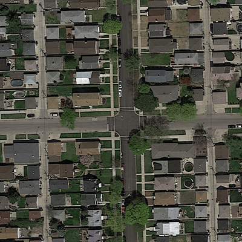

# Road Segmentation 
 Road Segmentation.Image Segmentation using CNN tensorflow with SegNet
 
 **Abstract In  this  work  we  present  two  methods  to  segmentroads  on  satellite  images.  We  first  show  how  we  can  augmentan  image  dataset  when  the  one  at  disposal  is  too  small  toproperly train a machine learning algorithm. Then we quicklydemonstrate what features can be exploited and how to handlethem in order to make the best prediction with a linear logisticregression. Finally, we present a method based on a deep fullyconvolutional  neural  network  architecture  for  semantic  pixel-wise  segmentation  called  SegNet.
 **
 
 ## Introduction
 The goal of this work is to segment roads on satellite images (Figure 1) by using machine learning techniques.
In other words, we want to assign a label (road or background) to each pixel of the image. Before selecting
the best algorithm, an effort is made on how to augment
a small image data set and how to get the most relevant
features out of it. Then we present 2 different classes
of algorithm. The first one is a linear logistic regression
whereas the second one, called SegNet [1] uses a more
complicated scheme based on a convolutional neural
network (CNN).

A set of N = 100 training images of size 400 × 400
pixels is provided. The set contains different aerial
pictures of urban areas. Together with this training set, the
Figure 2.
Ground truth of satellite image example.
corresponding ground truth grayscale images (Figure 2) are
also available. Note that the ground truth images need to
be converted into label images. Concretely, each pixel y i
can only take one of the two possible values corresponding
to the classes: road label (y i = 1) or background label
(y i = 0). In order to binarize the ground truth images, a
threshold of 25% is set. This means that every pixel with
an intensity lower than 75% of the maximum possible value
is set to 0 and the rest is set to 1. With 8 bits images, the
maximum value is 255 which sets the threshold to 191.
This pixel threshold has a direct impact on the width of the
road label in the computed label image.
 
 

 
 [Report can be found here in pdf](projectRoadSegmentation/bazinga-submission.pdf)
